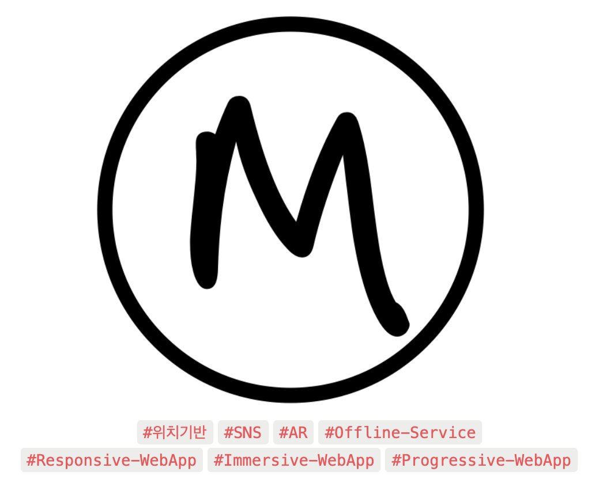
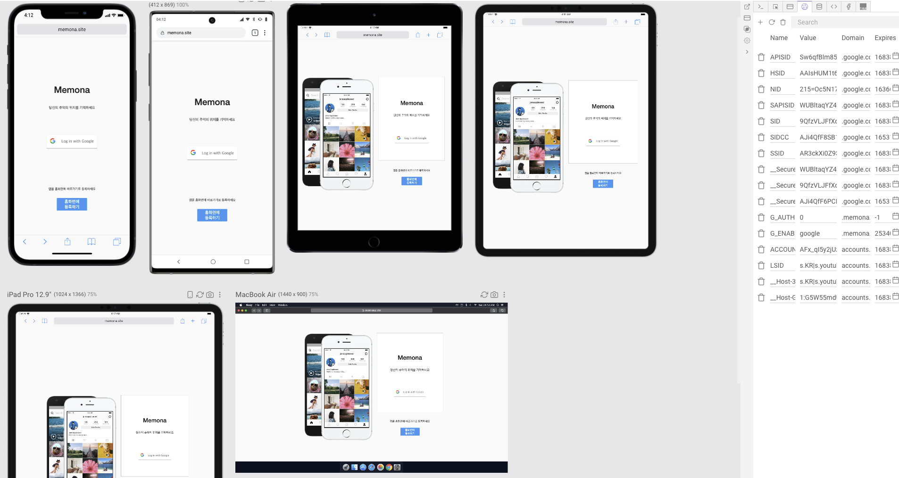
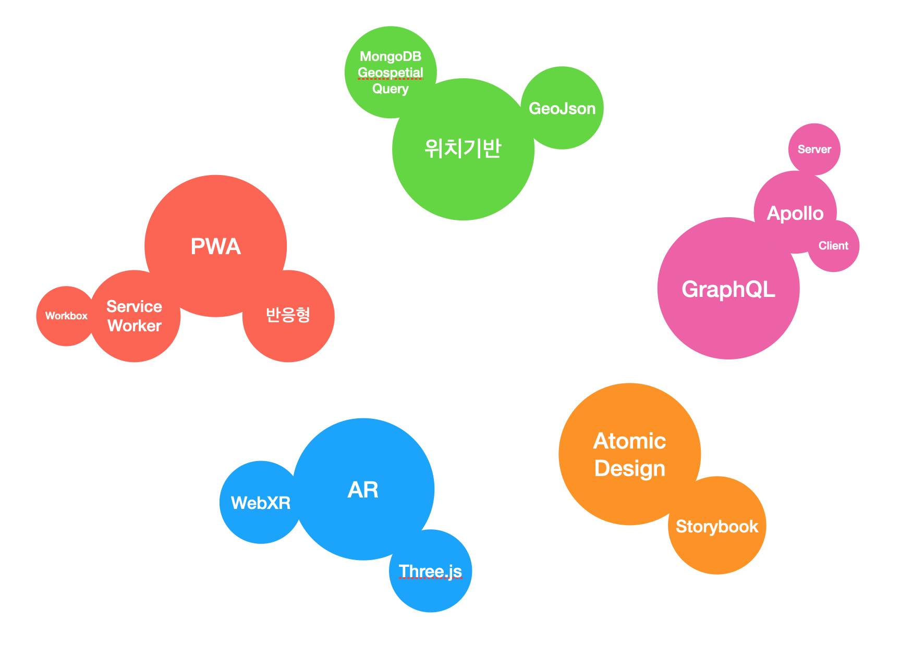

# Memona

<center></center>

## Summary

- 위치기반 SNS
- `AR` 을 활용한 포스팅 올리기 기능
- PWA - 앱 다운, 스플레쉬 화면, 오프라인 처리 지원
- Atomic Design Structure, GraphQL, StoryBook
- 더 궁금하다면? 👇
    - [🔗 관련 링크](#-관련-링크)
    - [💡Introduce Project](#introduce-project)
      + [🚗 Motivation](#-motivation)
      + [🍁 Memona - 내 추억과 기억을 그 위치에 저장하는 SNS](#-memona---내-추억과-기억을-그-위치에-저장하는-sns)
      + [📌 Feature](#-feature)
        + [🔧 Stack](#-stack)
      + [🎯 Requirements](#-requirements)
      + [💿 Installation](#-installation)
        - [FrontEnd](#frontend)
        - [BackEnd](#backend)
  - [🧩 저는 이렇게 개발했습니다.](#-저는-이렇게-개발했습니다)
    * [1. Atomic Design](#1-atomic-design)
    * [2. Responsive Development](#2-responsive-development)
    * [3. 커스터마이징 지역](#3-커스터마이징-지역)
  - [🚀 도전했던 기술과 어려웠던 점](#-도전했던-기술과-어려웠던-점)
    * [1. GraphQL](#1-graphql)
      + [Apollo-Server](#apollo-server)
      + [Apollo-Client](#apollo-client)
    * [2. 위치기반](#2-위치기반)
    * [3. PWA](#3-pwa)
    * [4. AR](#4-ar)
  - [🛠 서브 프로젝트](#-서브-프로젝트)
      + [Apollo Server Standalone Boiler (Apollo Server v2)](#apollo-server-standalone-boiler-apollo-server-v2)
      + [Apollo Client Standalone Boiler (Apollo Client-React v3)](#apollo-client-standalone-boiler-apollo-client-react-v3)
      + [GeoJson Polygon Generator](#geojson-polygon-generator)

<br>

## 🔗 관련 링크

- **Deploy Site** : **https://memona.site**

- **Github Repositories**

  - FrontEnd : **https://github.com/Ha-Young/memona-frontend**
  - BackEnd : **https://github.com/Ha-Young/memona-backend**

<br>

## 💡Introduce Project

### 🚗 Motivation

이 프로젝트의 동기는 간단합니다.

- **프론트엔드도 이제 이런거 할 수 있어!**
- **프론트엔드가 짱이야!**

제가 타 개발직군에서 프론트엔드 개발자가 되기로 마음먹었던 이유는 바로 브라우저가 할 수 있는 것들이 점점 많아지고 있다는 것이었습니다. 예전에는 브라우저가 할 수 없었던 것들이 이제는 점점 가능해지고 있고, 거기다 접근성까지 좋으니 웹 개발의 미래는 매우 밝아보였습니다. 당연히 그 중심에는 프론트엔드가 있었습니다.

저는 이번 프로젝트에서 프론트엔드가 어디까지 와있는지, 어디로 향해 가는지 몸소 느껴보고싶었고 2차 프로젝트는 꼭 최근 심심치않게 들려오는 기술, 아키텍처와 사용하고 싶었던 기술로 프로젝트를 만들어야겠다고 마음먹었습니다.

그렇게 `Atomic Design Pattern`, `GraphQL`, `Storybook`, `PWA`, `AR(WebXR)` 등 프론트엔드에서 나름 인정받는 최신 기술 스택들과 동시에 저의 감성이 더해져 **Memona**가 탄생하였습니다.

<br>

### 🍁 Memona - 내 추억과 기억을 그 위치에 저장하는 SNS

Memona의 **Catch Phrase**는 `당신의 추억과 기억을 그 위치에 기록하세요` 입니다.

요즘 당근 마켓을 필두로 로컬 기반 서비스가 많은 관심을 받고 있습니다. 로컬 기반의 O2O, 로컬 기반 커머스 등 다양한 아이디어를 고민하다가 로컬을 기반으로 하는 SNS가 있었으면 좋겠다는 생각을 하게되었습니다.

조금 더 감성적으로 접근해 추억과 기억을 위치에 기록을 한다는 개념으로 나아가게 되었고 이를 **AR을 이용한 Immersive WebApp으로 표현**해보자고 생각하게되었습니다.

기본적으로 **내가 있는 위치에 대한 글만** 보고 쓸 수 있으며 `해당 위치에 AR을 통한 일종의 벽화`같은 느낌을 주려고 하였습니다. 

해당 위치에 년도와 계절을 설정해 그 때 어떤 추억들이 있는지 볼 수 있습니다.


### 📌 Feature

- 모바일 앱보다 더 모바일 앱 같은 `웹 앱` 입니다. (PWA)
  - 스플래시 화면 지원
  - 홈 화면에 등록시 앱처럼 앱 목록에서 사용할 수 있습니다. (안드로이드 한정)
  - 오프라인 서비스를 지원합니다. (`ServiceWorker` `WorkBox`)
    - 오프라인 상태여도 서비스를 계속 이용할 수 있습니다.
    - 예전에 패칭해 온 데이터를 보여줍니다.
    - 오프라인에서 포스트 작성시 기억해두었다가 온라인 연결이되면 자동으로 보내줍니다.
- 위치기반의 앱으로 현재 나의 위치를 알려줍니다.
  - **GeoJson 기반으로 위치를 등록**하여 단순한 행정구역이 아닌 `직접 커스텀한 위치`로 표시할 수 있습니다.
    - ex) `가로수길`, `올림픽공원`, `송리단길`, `역삼역 부근`, `경복궁`, `힙지로` 등등...
- 내가 있는 위치에 대한 포스트만 읽고 쓸 수 있습니다.
  - 년도-계절 선택을 하지 않았을 경우 무작위로 현재 위치에 대한 포스트를 가져와 보여줍니다.
  - 년도-계절을 선택 했을 경우, 현재 위치의 해당 년도-계절에 대한 포스트를 가져와 보여줍니다.
- 카메라 촬영, 이미지 공유 등을 할 수 있고 Comment를 남길 수 있습니다.
  - 웹 브라우저는 이미지 공유만 할 수 있습니다.
- **AR을 활용한 포스트**를 남길 수 있습니다.
  - `AR 페인트` (그리기)
  - `AR Hit-Test`를 이용해 3D 모델 띄우기
  - `3D Text` 작성
  - 페인트와 3D Text 색상 변경
- 내가 올린 추억들을 모아 볼 수 있습니다.

<br>

### 🔧 Stack

**Front-end**

- ES2015+
- React
  - Atomic Design Pattern
  - React-router-dom
  - Styled-Component
- GraphQL
  - Apollo-Client
- AR
  - WebXR-API
  - Three.js
- PWA
  - ServiceWorker
  - WorkBox
  - idb-keyval
- StoryBook

**Back-end**

- Node.js
- GraphQL
  - Apollo-Server
- MongoDB
- Mongoose
- JWT (JSON Web Token)
- AWS-S3
- Google-auth

<br>

### 🎯 Requirements

- Mobile - Andorid
- Browser - Chrome, Chrome-Android
- Node Version - v12.22.1

<br>

### 💿 Installation

#### FrontEnd

1. 프로젝트를 다운 받은 후 프로젝트 디렉토리 내부에서 다음 명령어 입력

```bash
yarn
```

> `yarn`을 이용해서 설치합니다

2. 환경설정 (.env file)을 아래와 같이 입력해야 합니다.

```
NODE_VERSION=12.22.1
REACT_APP_GOOGLE_CLIENT_ID=<YOUR_GOOGLE_CLIENT_ID>
REACT_APP_GRAPHQL_API_URI=<YOUR_GRAPHQL_SERVER_URI>
```

> **Guide**
>
> - REACT_APP_GOOGLE_CLIENT_ID: [Goolge API](https://console.cloud.google.com/apis/credentials?folder=&hl=ko&organizationId=&project=memona)의 OAuth 2.0 클라이언트 ID
>
> - REACT_APP_GRAPHQL_API_URI: GraphQL 서버 URI
>
>   > ex) http://localhost:5000


#### BackEnd

1. 프로젝트를 다운 받은 후 프로젝트 디렉토리 내부에서 다음 명령어 입력

```bash
yarn
```

> `yarn`을 이용해서 설치합니다

2. 환경설정 (.env file)을 아래와 같이 입력해야 합니다.

```
STAGE=<YOUR_STAGE>
MONGO_ENDPOINT=<YOUR_MONGODB_DATABASE_URL>

JWT_TOKEN_SECRET=<YOUR_JWT_TOKEN_SECRET>
JWT_TOKEN_EXPIRES_IN=1d

GOOGLE_CLIENT_ID=<YOUR_GOOGLE_CLIENT_ID>

KAKAO_REST_API_KEY=<YOUR_KAKAO_REST_API_KEY>

AWS_ACCESS_KEY=<YOUR_AWS_ACCESS_KEY>
AWS_SECRET_ACCESS_KEY=<YOUR_SECRET_ACCESS_KEY>
AWS_S3_REGION=<YOUR_S3_REGION>
AWS_S3_IMAGE_BUCKET_NAME=<YOUR_S3_BUCKET_NAME>
```

>  **Guide**
>
> - STAGE: 서버 Stage 설정
>
>   > `development` OR ` production`
>
> - MONGO_ENDPOINT: MongoDB Cloud Database URL
>
>   - [MongoDB Atlas](https://www.mongodb.com/cloud/atlas)
>
> - JWT_TOKEN_SECRET: JWT Token을 만드는데 필요한 키 값
>
> - GOOGLE_CLIENT_ID: [Goolge API](https://console.cloud.google.com/apis/credentials?folder=&hl=ko&organizationId=&project=memona)의 OAuth 2.0 클라이언트 ID
>
> - KAKAO_REST_API_KEY: KAKAO REST API KEY
>
>   - [KAKAO Developers](https://developers.kakao.com/)
>
> - AWS_ACCESS_KEY: AWS ACCESS KEY
>
> - AWS_SECRET_ACCESS_KEY: AWS SECRET ACCESS KEY
>
> - AWS_S3_REGION: AWS S3 지역 코드
>
>   > ex) ap-northeast-2
>
> - AWS_S3_IMAGE_BUCKET_NAME: S3 Bucket 이름

<br>

# 🧩 저는 이렇게 개발했습니다.

## 1. Atomic Design

- **[generact](https://github.com/diegohaz/generact)와 atomic sample을 활용한 개발**

  **generact**는 새로운 파일을 만들 때 이미 만들어진 폴더구조를 그대로 이름만 바꿔서 복사해주는 CLI 명령어입니다.

  주로 개발을 할 때 비슷한 파일을 복사해서 만들 확률이 높은데, 이를 간편하게 CLI 명령어로 복사를 하면 더 편하지 않겠냐는 제작자의 생각에 큰 공감을 하기도 했고, `Atomic Design` 구조로 개발을 할 때 도움이 많이 되겠다고 생각하였습니다.

  이유는 이전에 `Atomic Design` 구조로 개발을 했던 연습 프로젝트에서 다양한 Prop을 받고 Option이 많아야 하는 `Atoms` `Mocules` 를 개발할 때 시간 소모가 매우 컸고 어려움을 겪었는데, 이때 느낀 점이 누군가가 만들어놓은 잘 만들어진 `Atoms`나 `Mocules` 등을 재사용하면 생산성이나 퀄리티가 더욱 올라갈 거로 생각하였고 이를 **generact**가 쉽게 해줄 수 있기 때문입니다.

  방법은 잘 만들어진 `Atomic Design` 샘플 파일들을 가져와서 Sample-Components 폴더에 분류하여 넣어두고, 개발을 진행하다가 필요한 Component가 생기면 필요한 Component와 비슷한 구조로 되어 있거나 같은 샘플을 **generact**로 복사 및 수정하여 개발하였습니다.

  이를 통해 이전에 `Atomic Design`을 개발할 때보다 생산성과 소스 퀄리티를 올릴 수 있었고 특히 폴더구조가 통째로 복사되기 때문에 내부의 Storybook Code나 Test Code가 함께 복사되어 매우 만족하며 사용하였습니다.

- **StoryBook 사용**

  Bottom-Up으로 개발을 하는 `Atomic Design`의 개발 중, 완성된 페이지로 전체적인 화면을 보기 전에 `Atoms`, `Molecules`, `Organisms`와 같이 단위별로 컴포넌트의 UI/UX를 미리미리 확인하고 개발 할 수 있는데 큰 도움이 될 것 같아 도입하였습니다.

  사용하면서 예전 연습 프로젝트에서 `Atomic Design`을 활용해 개발할 때 Bottom-Up 작은 단위부터 개발하는 것이 UI 개발 상황을 확인하면서 개발하는 것이 불편했는데 이를 작은 단위부터 확인 할 수 있다는 것이 좋았고, 직접 개발페이지로 들어가지 않고 확인할 수 있는 점에서 매우 만족스러웠습니다.

  `Atomic Design` 구조가 아니라도 StoryBook은 개발과 협업에 큰 도움이 될 것 같다는 느낌을 받았습니다.

<br>

## 2. Responsive Development

- **[Sizzy](https://sizzy.co/)를 통한 다양한 디바이스 Responsive view 확인**

  Sizzy는 웹 페이지를 원하는 디바이스 별로 볼 수 있게하는 프로그램입니다.

  Sizzy를 이용해서 제가 가지고있지않은 디바이스 별로 반응형 화면을 확인하고, 크롬 개발자 모드에서 번거롭게 확인할 필요가 없이 개발을 할 수 있었습니다.



<br>

## 3. 커스터마이징 지역

- geoJson Polygon 생성 웹페이지 개발 및 배포

  제가 기획을 할 때 일반적인 행정구역이 아닌 커스터마이징 된 지역으로 표시를 하고 싶었는데, 이 커스터마이징 지역을 geoJson의 Polygon 타입의 데이터로 생성하여 DB에 등록 할 필요가 있었습니다.

  이를 위해 geoJson Polygon 생성을 쉽게 도와주는 페이지를 찾았는데 없었고,  제가 직접 간편하게 geoJson Polygon 데이터를 생성하는 페이지를 만들게 되었습니다.

  [GeoJson Polygon Map](https://ha-young.github.io/GeoJsonPolygonGenerator/)

  

<br>

# 🚀 도전했던 기술과 어려웠던 점

<center></center>

## 1. GraphQL

### [Apollo-Server](https://www.apollographql.com/)

Apollo-Server 같은 경우는 대부분이 Rest-API와 함께 구축된 서버를 사용하기 위해 Apollo-Server-Express로 Express가 Integration된 것을 사용하는 것에 반해 저는 Rest-API를 이번에 사용하지 않을 것이어서 Express없이 Apollo-Server Standalone으로 사용하였습니다.

처음 학습하는 것이기 때문에 학습을 하면서 진행하느라 많이 힘들었고, 제대로 구축하기위해 노력하였습니다.

Apollo-Server의 Datasource, Context 모두 사용하려고 노력하였고 이전 Express 서버를 구축했을 때 3Layer Architecture처럼 Service Layer를 두려고 하였지만 Datasource와 중복된다고 느껴 따로 만들지는 않았습니다.

특히 Apollo-Server Standalone와 더불어 많은 Apollo-Server Structure에 대한 Reference가 많이 부족하였기 때문에 제가 직접 GraphQL의Structure를 구축하면서 어떻게 구축해야 좋을지 상당히 많은 고민을 하면서 만들었습니다.

특히나 어려웠던 점은 File upload로 GraphQL의 단점 답게 GraphQL 자체에서 파일업로드 방법에 대한 명시가 정확하게 없었고 외부 라이브러리 ([graphql-upload](https://www.npmjs.com/package/graphql-upload)) 를 사용해서 구현할 수 있었습니다. 이를 사용하기위해 node version을 down grade 하는 등 별도의 환경 변경등의 작업또한 처리해야 했습니다.

### [Apollo-Client](https://www.apollographql.com/)

Apollo-Client 같은 경우는 별도의 전역상태 상태관리를 할 수 있는 방법으로 [Reactive variable](https://www.apollographql.com/docs/react/local-state/reactive-variables/)를 제공해 주는데, 사용법이 너무 편리해서 이전에 사용했던 상태관리 툴인 Redux, ContextAPI와 다르게 너무 편리하다는 느낌을 받았고 비동기로 받는 데이터를 캐싱처리 할 때 어떻게 캐싱처리를 할 것인지 캐싱 정책등을 내가 정할수도 있는 등 여러 편리한 장치들이 많아서 너무 좋은 경험이었습니다.

query를 처리하는 hook의 사용법도 너무 편리했었으나 단점으로는 GraphQL query를 여러번 사용해야 하는 경우(Infinity scroll)에는 별도 방법을 사용해야 하고(fetchMore) 캐싱 정책도 정해주는 등의 번거로움이 조금 있었습니다.

<br>

## 2. 위치기반

[Geospatial Queries - MongoDB Manual](https://docs.mongodb.com/manual/geospatial-queries/)

위치기반의 경우 단순히 지도 API를 통한 행정구역을 가져오는 것이 아닌, 커스터 마이징 시킨 위치로 가져오고 싶었습니다.

처음에 지도 API의 근처에 있는 큰 지명이나 건물에 대한 정보를 이용하려고 하였으나 한계를 느꼈고, 별도로 제가 데이터를 구축해야겠다는 생각이 들었습니다. 이를 위해 Area Collection에 geoJson Polygon 타입의 데이터로 DB에 저장을 하고, mongoDB의 geospatial Queries를 사용하기로 하였습니다.

이를 통해 위에서 소개한 [geoJsonPolygon](https://www.notion.so/80227df485e5402d8acf40ee1bfd39b2) 생성 페이지를 만들게 되었습니다.

geoJson 형태로 데이터를 만드는건 쉬웠으나 정교하게 데이터를 생성하고 빠른 생성이 어려워서 커스터마이징 지역이 아닌 곳은 kakao API를 사용하여 행정구역의 가장 작은 단위로 가져올 수 있도록 처리하였습니다.

이를 통해 쉽고 효율적으로 커스텀 지역을 만들 수 있었으며, 지도 API를 React와 함께 사용하는 경험을 할 수 있었습니다.

<br>

## 3. PWA

PWA 구축으로 serviceWorker, workBox를 주로 이용하여

- manifest 파일 작성
- 정적 데이터 캐싱
- 동적 데이터 캐싱
- 데이터 전송(파일 전송 등) Sync

과 같은 작업을 하였습니다.

manifest, 정적데이터 캐싱은 workBox를 사용하여 쉽게 구현할 수 있었지만, 동적 데이터 캐싱과 데이터 전송 Sync 맞추는 작업은 생각보다 쉽지 않았습니다.

특히 url을 캐싱에 대한 키값으로 사용하는 serviceWoker 및 workBox로는 단일 endpoint(url)을 가지고 있는 GraphQL 처리가 어려웠는데,

이를 동적 데이터 캐싱에는 GraphQL 앤드포인트를 잡고 request객체의 body를 `JSON.stringfy()` 하고, graphQL query문과 variables를 합치고 해싱처리하여 이에 대한 키를 만들어 indexDB에 저장하는 커스텀 networkFirst 전략을 만들었고,

데이터 전송 Sync는 위의 networkFirst전략이 실패하고 캐싱처리된 값도 없을 때, workBox의 `workbox-background-sync` 의 `Queue` 에 request를 넣어서 network상태가 되었을 때 자동으로 `Queue` 에 있는 request 요청을 보내 Sync를 맞추도록 하였습니다.


> 위 영상은 오프라인 상태에서 4개의 포스트를 올린 후 다시 온라인 전환시 올렸던 4개의 포스트가 다시 전송되는 것을 보여주고 있습니다.  <우측 개발자 도구 Network 탭 확인>

<br>

## 4. AR

AR은 webAPI로 제공되는 webXR의 [XRSessionMode](https://developer.mozilla.org/en-US/docs/Web/API/XRSessionMode) `immersive-ar` 로 설정하고, `webGLLayer`에 `three.js` 를 이용하여 webGL 요소를 그릴 수 있게 개발하였습니다.

three.js를 통한 3D 프로그래밍인 것이 힘들었고 이를 위해 관련 reference를 많이 참고하였습니다.

특히 캡처기능을 구현 할 때 호환성 문제를 많이 겪었는데, 캡처기능을 위해 처음에 `Screen Capture API`를 사용하고자 하였으나, Chrome Android 웹브라우저에서는 지원이 안되어서 다른 방법을 찾아야 했습니다.

WebXR AR모드 자체에서 캡처기능을 제공하지 않고, AR모드 내부적으로 작동되는 카메라 모드는 일반적인 buffer를 사용하지 않고 `webGLLayer` 또한 별도로 존재하기 때문에 화면 프레임을 이용한 캡처를 하기가 불가능 하였고 화면 프레임을 이용한 캡쳐가 아닌 다른방법을 찾기 시작했습니다.

그렇게 시도한 방법으로는

1. 개발 한 WebApp은 React Native의 WebView로 올리고 캡처는 React Native를 이용한 기기캡처 사용

   이 방법은 React Natvie를 학습하여 WebApp을 WebView로 올리고 캡처까지 성공하였으나, webView 브라우저에 WebXR API가 지원이 되지않아 AR 모드 자체가 불가능하였습니다.

   이렇게 두번이나 호환성 문제를 겪은 경험을 통해 개발전에 호환성을 제대로 확인해야겠다고 생각하게 되었습니다.

2. `getUserMedia()` 를 통한 순간 카메라 캡처화면과 AR모드의 `webGLLayer` 의 webGL요소 합성

   이 방법은 도중에 시간소모가 너무 큰 것같아 중단하였지만 이후에 시도해보려고 합니다.

<br>

# 🛠 서브 프로젝트

### Apollo Server Standalone Boiler (Apollo Server v2)

관련 Reference가 많이 없고, 괜찮은 Starter나 Boilerplate가 없는 Apollo Server Standalone을 위한 Boilerplate 입니다. 저 처럼 처음 시작하는 사람들을 위해 만들었습니다.

- 설계한 GraphQL Structure 구조
- context를 이용한 authentication
- DataSource를 이용해 MongoDB 연동 (ODM - Mongoose)
- DataSource를 이용해 Rest API 요청
- graphql-upload를 이용한 file upload 지원

링크 : https://github.com/Ha-Young/Apollo-Server-Standalone-Boiler

### Apollo Client Standalone Boiler (Apollo Client-React v3)

위의 Apollo Server Standalone Boiler를 위한 Apollo Client-React Boilerplate입니다.

- Infinity Scroll 처리 (fetchMore)
- query 활용 예시
- 캐싱 처리 예시
- graphql-upload를 위한 link처리

링크 : https://github.com/Ha-Young/Apollo-Client-Standalone-Boiler

### GeoJson Polygon Generator

앞서 설명했던 geoJson Polygon 데이터 생성기입니다.

링크: https://github.com/Ha-Young/GeoJsonPolygonGenerator

